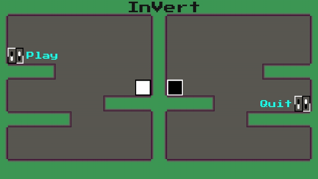

 
  

  &#xa0;

  <a href="https://ufrshubham.itch.io/invert">Play on itch</a>

<h1 align="center">Invert</h1>

  

  

  

  

  

  

   

<!-- Status -->

<h4 align="center"> 
	🚧  Status Prototype Released 🚧
</h4> 

  <a href="#dart-about">About</a> &#xa0; | &#xa0; 
  <a href="#rocket-technologies">Game Engine</a> &#xa0; | &#xa0;
  <a href="#memo-license">License</a> &#xa0; | &#xa0;

 

## :dart: About ##

Invert is a classis 2D puzzle platformer created as a submission for <a href="https://itch.io/jam/tri-annual-jam">Tri-Annual-Jam #1</a>. The theme for this jam was "You are your enemy" and to adhert to this theme, Invert present you with 1 controller-2 characters mechanics. This means if you press left, one character moves left and the other one moves right. You have to compelete each level without hitting each other. Since this game was created with a limited time frame, it has very limited levels.

## :rocket: Technologies ##

The following tools were used in this project:

- [Godot](https://godotengine.org/)

## :memo: License ##

This project is under license from MIT. For more details, see the [LICENSE](LICENSE.md) file.

&#xa0;

<a href="#top">Back to top</a>
